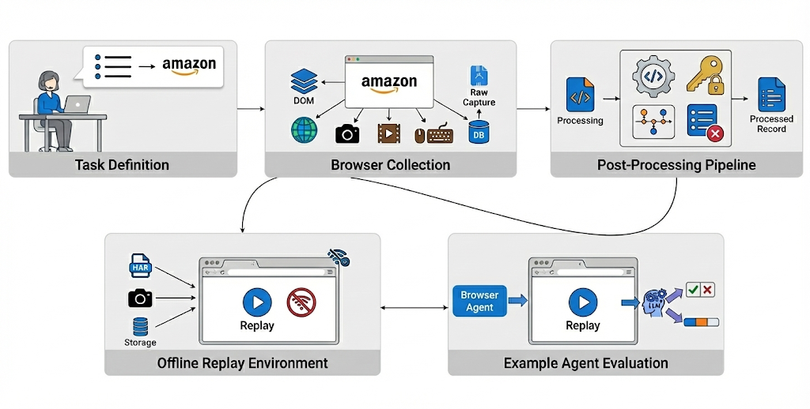
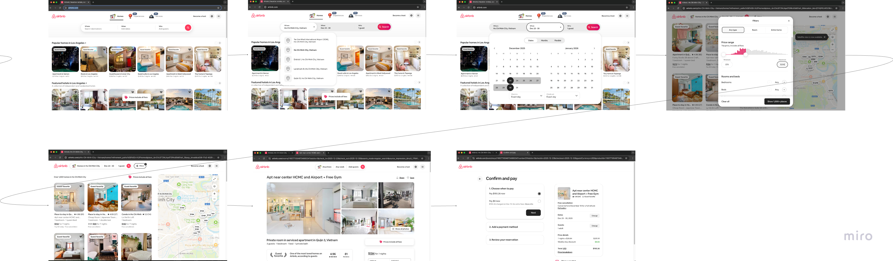
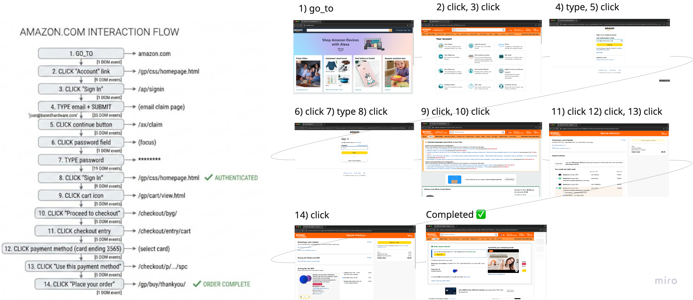
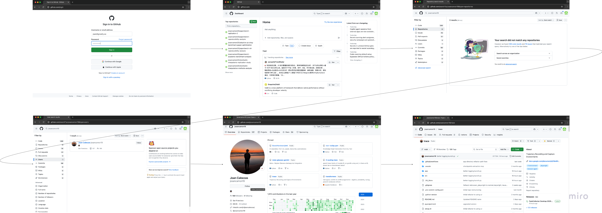

# TRACE: Trajectory Recording and Capture Environments

> **Browser agents are hill climbing in the wrong direction.**

<p align="center">
  
</p>

This repository contains the full collection → replay → evaluation stack described in the research notes here: https://joan.so/learning/ml/research/browser-automation/0+main. The goal is to make it trivial to capture thousands of long-horizon, economically valuable browser trajectories, replay them offline, and grade agents with granular checkpoints.

## Dataset

A sample dataset of captured environments is available on Hugging Face:

🤗 **[josancamon/trace-environments](https://huggingface.co/datasets/josancamon/trace-environments)** — 6 real-world tasks with full trajectories, DOM states, and replay bundles.

Each task includes:
- Golden human trajectory with step-by-step actions
- DOM snapshots at each interaction point
- HAR recordings for offline replay
- Screenshots and video recordings
- Checkpoint annotations for partial-credit evaluation

## Highlights

- Record real human browsing with stealth Playwright, HAR capture, DOM diffs, screenshots, and screen video.
- Package every task as a reproducible sandbox (`data/captures/...`) that can be replayed without touching the live internet.
- Run Browser-Use agents or OpenAI Computer Use (CUA) through the same evaluation harness.
- Judge outputs with binary + checkpointed LLM graders powered by DSPy.
- Ship the workflow to non-technical collectors through a Tk desktop app or PyInstaller bundle.
- Upload datasets to GCS / Hugging Face with ready-made scripts.

## Example Tasks

<details>
<summary><strong>🏠 Airbnb — Find an apartment under $200 in Ho Chi Minh City</strong></summary>

<p align="center">
  
</p>

Multi-step booking flow: search location → select dates → apply price filter → browse results → select listing.
</details>

<details>
<summary><strong>🛒 Amazon — Complete a checkout with saved payment method</strong></summary>

<p align="center">
  
</p>

Full e-commerce flow: login → navigate to cart → proceed to checkout → select payment → place order.
</details>

<details>
<summary><strong>🐙 GitHub — Search and navigate repositories</strong></summary>

<p align="center">
  
</p>

Developer workflow: login → search repositories → filter results → navigate to user profile → explore projects.
</details>

> 📹 **See the collection process in action:** [`readme/collection.mp4`](readme/collection.mp4)

---

> [!WARNING]
> **🚧 Work in Progress** — This pipeline is functional but not battle-tested. Expect rough edges, undocumented edge cases, and breaking changes. If you run into issues, please [open an issue](../../issues) — your bug reports help shape the roadmap and will be documented as we go.

---

## Table of Contents

- [TRACE: Trajectory Recording and Capture Environments](#trace-trajectory-recording-and-capture-environments)
  - [Dataset](#dataset)
  - [Highlights](#highlights)
  - [Example Tasks](#example-tasks)
  - [Table of Contents](#table-of-contents)
  - [Repository Map](#repository-map)
  - [Getting Started](#getting-started)
    - [Prerequisites](#prerequisites)
    - [Install dependencies](#install-dependencies)
    - [Environment variables](#environment-variables)
  - [Record a Task (CLI)](#record-a-task-cli)
  - [What Gets Captured](#what-gets-captured)
  - [Post-Processing Pipeline](#post-processing-pipeline)
    - [1. `postprocess-toolcalls`](#1-postprocess-toolcalls)
    - [2. `postprocess-credentials`](#2-postprocess-credentials)
    - [3. `postprocess-set-checkpoints`](#3-postprocess-set-checkpoints)
    - [4. `postprocess-determine-ignore`](#4-postprocess-determine-ignore)
  - [Replay Captured Environments](#replay-captured-environments)
  - [Evaluation Runners](#evaluation-runners)
    - [Browser-Use Harness (`eval-run-browseruse`)](#browser-use-harness-eval-run-browseruse)
  - [Evaluation Dashboard](#evaluation-dashboard)
    - [Benchmarks Included](#benchmarks-included)
    - [Features](#features)
  - [Judges \& Metrics](#judges--metrics)
    - [Binary grading (`eval-judge-binary`)](#binary-grading-eval-judge-binary)
    - [Checkpointed grading (`eval-judge-checkpointed`)](#checkpointed-grading-eval-judge-checkpointed)
  - [Workflow Overview](#workflow-overview)
  - [Desktop Task Collector](#desktop-task-collector)
    - [Building a distributable app](#building-a-distributable-app)
  - [Data Review \& Sharing](#data-review--sharing)
  - [Configuration Reference](#configuration-reference)
  - [Resources](#resources)


## Repository Map

```
web-environments/
├── src/
│   ├── main.py                    # Typer CLI for recording (`web-envs`)
│   ├── browser/                   # Stealth Playwright capturer
│   ├── environments/              # Offline replay + sandbox plumbing
│   ├── eval/                      # Agent runners, harness, judges
│   ├── scripts/
│   │   ├── postprocessing/        # Tool calls, creds, checkpoints, ignore list
│   │   └── collection/            # Merge/view/upload scripts
│   ├── db/, config/, utils/       # Storage + helper modules
│   └── models.py                  # Shared data models
├── app/                           # Tk Task Collector + PyInstaller packaging
├── data/                          # Default recording/output root (configurable)
├── readme/                        # Documentation assets (images, videos)
├── results/                       # Agent evaluation dumps (per run)
├── paper.md                       # Draft write-up / appendix
├── setup.sh                       # macOS bootstrap for collectors
├── pyproject.toml / uv.lock       # Dependency + CLI entry points
└── README.md                      # This file
```

## Getting Started

### Prerequisites

- macOS or Linux (recording is built/tested on macOS 14+, replay works anywhere Playwright does).
- Python **3.13+** (enforced in `pyproject.toml`).
- [uv](https://github.com/astral-sh/uv) package manager.
- Chrome/Chromium installed (recorder launches the `chrome` channel by default).

### Install dependencies

```bash
curl -LsSf https://astral.sh/uv/install.sh | sh
cd /Users/joancabezas/Downloads/projects/ai-research/web-environments
uv sync
```

Install Playwright browsers once per machine:

```bash
uv run playwright install chromium
```

### Environment variables

Create/update `.env` next to `pyproject.toml` and set at minimum:

```
OPENAI_API_KEY=sk-...
# Optional, used when falling back to Kernel live browsers during eval
KERNEL_API_KEY=...
# Optional override for data root (defaults to <repo>/data)
TASK_COLLECTOR_DATA_ROOT=/absolute/path/to/storage
```

`uv run` automatically loads `.env` via `python-dotenv`.

## Record a Task (CLI)

Run:

```bash
uv run web-envs
```

The CLI prompts for:

1. **Source** (where the task came from: self, mind2web seed, etc.).
2. **Task type** (information retrieval vs. action).
3. **Natural-language description** and target **website**.

Flags:

- `--dev` — auto-fill prompts with defaults for faster debugging.
- `--dev-url https://example.com` — open a URL on launch (requires `--dev`).
- `--no-browser-console` — silence console logs.

What happens:

- A stealth Playwright Chromium context launches with custom args and anti-detection scripts (`playwright-stealth` + custom JS).
- Every DOM mutation, click, scroll, navigation, screenshot, video frame, HAR entry, console line, and storage snapshot is recorded.
- Hitting **Enter** in the terminal (or Ctrl+C) stops recording. Information-retrieval tasks additionally prompt for the final answer before closing.

Outputs (per task):

- SQLite rows in `data/tasks.db`.
- Raw steps in `data/steps/task_<id>.jsonl`.
- Bundle in `data/captures/task_<id>/`.
- `data/screenshots/task_<id>/*.png`, `data/videos/task_<id>/*.webm`, `data/doms/task_<id>/step_<n>.txt`.

## What Gets Captured

The recorder performs a lossless export of everything needed for offline replay:

- **Human trajectory:** ordered tool-call log with DOM context inline.
- **Network layer:** HAR file + per-request JSON dumps + LM-assisted ignore lists.
- **Storage:** cookies, localStorage, IndexedDB snapshots.
- **Visuals:** high-rate screenshots and a 720p video stream per session.
- **Console + metadata:** enriched with event timings, selectors, coordinates, and page-level events (tab opened/closed, focus changes, etc.).

Default layout (configurable through `TASK_COLLECTOR_DATA_ROOT`):

```
data/
├── captures/task_<id>/manifest.json, recording.har, resources/, storage/
├── screenshots/task_<id>/*.png
├── videos/task_<id>/*.webm
├── doms/task_<id>/step_<n>.txt
├── tasks.db / tasks.db-shm / tasks.db-wal
├── tasks.jsonl
└── debug/, steps/, ...
```

The [TRACE Environments dataset](https://huggingface.co/datasets/josancamon/trace-environments) contains real examples with full capture bundles. Download and point `TASK_COLLECTOR_DATA_ROOT` to experiment without collecting new data.

## Post-Processing Pipeline

Run these after collecting tasks. Each command is defined in `pyproject.toml` and executed with `uv run <script>`.

### 1. `postprocess-toolcalls`

- **Command:** `uv run postprocess-toolcalls`
- **What it does:** Reads `tasks.db`, converts low-level events into structured tool calls, snapshots DOM states, and stores everything in `data/tasks.jsonl`.

### 2. `postprocess-credentials`

- **Command:** `uv run postprocess-credentials`
- **Requires:** `OPENAI_API_KEY`
- **What it does:** Uses DSPy + GPT-5 to detect login flows (email/password/phone, MFA, etc.) and associates them with domains so evaluations can inject credentials safely.
- **Output:** Augments each task entry in `tasks.jsonl` with a `credentials` array.

### 3. `postprocess-set-checkpoints`

- **Command:** `uv run postprocess-set-checkpoints`
- **Requires:** `OPENAI_API_KEY`
- **What it does:** Generates at least two semantic checkpoints (index + reasoning) per task, enabling partial-credit scoring.

### 4. `postprocess-determine-ignore`

- **Command:** `uv run postprocess-determine-ignore [--force]`
- **Requires:** `OPENAI_API_KEY`
- **What it does:** Cleans the HAR recordings by removing analytics/tracking requests via pattern matching + batched LLM classification. Produces `ignored.json` and `matches.json` per capture so the replay system can stay fully offline and cache LM matches when needed.

Batch runner: `src/scripts/postprocessing/run.sh` executes all steps sequentially.

## Replay Captured Environments

Use `launch-environment` to inspect or debug a bundle entirely offline.

```bash
uv run launch-environment data/captures/task_10 \
  --channel chrome \
  --run-human-trajectory \
  --ignore-cache
```

Key options:

- `--headless / --no-headless`
- `--channel chrome|chromium|msedge`
- `--allow-network-fallback` (default `False`) lets missing resources hit the live web.
- `--include-storage-state` restores cookies/session storage.
- `--run-human-trajectory` replays the recorded actions with original pacing.
- `--ignore-cache` disables LM match caching if you want fresh matches.

Behind the scenes the Typer app:

1. Loads the capture manifest + HAR.
2. Builds a Chromium context with HAR replay routing.
3. Aborts any URL matched in `ignored.json`.
4. Uses LM-based request matching when multiple HAR candidates resemble the same URL.
5. Optionally executes the human tool-call trajectory (`TaskStepExecutor`) for visual debugging.

## Evaluation Runners

### Browser-Use Harness (`eval-run-browseruse`)

```bash
uv run eval-run-browseruse --model gpt-5-nano
```

- Reads `data/tasks.jsonl`.
- Uses the sandbox bundles under `DATA_DIR/captures` by default; if a capture fails to start it falls back to Kernel live browsers (requires `KERNEL_API_KEY`).
- Captures agent DOM dumps per step in `results/<run>/doms/task_<id>/step_<n>.txt`.
- Writes JSON per task under `results/<run>/results/task_<id>.json` plus a summary metadata file.
- Limits concurrency to 1 when sandboxing to avoid cross-talk; uses up to 4 concurrent live sessions otherwise.

Result folder layout:

```
results/browseruse-gpt-5-nano-2025-11-18_04-12-27/
├── doms/task_<id>/step_<n>.txt
├── logs/
├── results/task_<id>.json
└── metadata.json
```

## Evaluation Dashboard

All of the benchmarks referenced in this repo feed into a shared dashboard at https://web-evals.streamlit.app that standardizes ingestion, filtering, and grading outputs across datasets. This was made for facilitating the exploration of them.

### Benchmarks Included

- GAIA (466 tasks) — general AI assistant benchmark with three difficulty tiers.
- Mind2Web (1,009 tasks) — real-world website interaction tasks.
- Mind2Web2 (130 tasks) — updated version with domain categorization.
- BrowseComp (1,266 tasks) — web browsing comprehension.
- WebArena (812 tasks) — realistic web navigation scenarios.
- WebVoyager (643 tasks) — long-horizon web navigation.
- REAL (113 tasks) — real-world web agent challenges with difficulty ratings.
- Bearcubs (111 tasks) — web agent evaluation tasks.
- Agent-Company (175 tasks) — domain-specific company workflows.
- OSWorld (400+ tasks) — desktop automation across Chrome, GIMP, LibreOffice, VS Code, etc.

### Features

- Interactive Streamlit dashboard for filtering, sorting, and exploration.
- REST API with full filtering, pagination, and schema stability guarantees.
- Unified schema that normalizes metadata across every benchmark.
- Advanced filtering by benchmark, difficulty, domain, website/app, and other tags.
- Global task search with full-text indexing over descriptions and instructions.


## Judges & Metrics

Two Typer CLIs grade agent outputs after a run.

### Binary grading (`eval-judge-binary`)

```bash
uv run eval-judge-binary --results-dir results/browseruse-gpt-5-nano-2025-11-18_04-12-27 --judge-model gpt-5
```

- Compares each model trajectory against the human one.
- Uses DSPy (`JudgeCompletion`) to decide correctness and produce reasoning + confidence.
- Writes `grade.json` inside the results directory with accuracy and failure breakdowns.

### Checkpointed grading (`eval-judge-checkpointed`)

```bash
uv run eval-judge-checkpointed --results-dir results/browseruse-gpt-5-nano-2025-11-18_04-12-27 --judge-model gpt-5
```

- Loads `grade.json`, finds failed tasks, and evaluates each checkpoint sequentially with partial credit (default 2 checkpoints, 0.33 score each).
- Adds `checkpoint_evaluation` and summary stats back into `grade.json`.

Both graders expect `OPENAI_API_KEY` to be configured and will stream multiple LLM calls, so budget accordingly.

## Workflow Overview

1. **Collect**
   ```
   uv run web-envs
   ```
2. **Process**
   ```
   uv run postprocess-toolcalls
   uv run postprocess-credentials
   uv run postprocess-set-checkpoints
   uv run postprocess-determine-ignore
   ```
3. **Replay / QA (optional)**
   ```
   uv run launch-environment data/captures/task_42
   ```
4. **Evaluate agents**
   ```
   uv run eval-run-browseruse --model gpt-5-nano
   uv run python -m eval.run.openai_cua   # optional runner
   ```
5. **Grade + analyze**
   ```
   uv run eval-judge-binary --results-dir <results_path>
   uv run eval-judge-checkpointed --results-dir <results_path>
   ```
6. **Upload / share** (see below).

## Desktop Task Collector

The `app/` directory ships a Tkinter UI for non-technical collectors:

```bash
./app/launch_task_collector.sh
# or
PYTHONPATH="$(pwd)/src:$(pwd):$PYTHONPATH" uv run python -m app.task_collector_app
```

Features:

- Mirrors the CLI prompts in a GUI form.
- Launches the stealth browser when the collector clicks **Start Task**.
- Provides an **Upload Data** button wired to the GCS scripts.
- Logs to the same `data/` directory configured by the backend.

### Building a distributable app

```bash
uv run python app/build_release.py --target macos
```

This wraps the recorder with PyInstaller, bundles Playwright, and drops a ZIP under `app/dist/`. Replace `macos` with `windows` to build on Windows.

## Data Review & Sharing

Helper scripts live in `src/scripts/collection/` (run with `uv run python -m ...`):

- `scripts.collection.view` — inspect tasks with a simple TUI.
- `scripts.collection.merge` — merge multiple `data/` folders.
- `scripts.collection.upload_gcp_data` — upload the entire `data/` directory to `gs://mind2web-subset/data/` (requires `google-credentials.json` in the repo root).
- `scripts.collection.upload_gcp_results` — push the `results/` directory.
- `scripts.collection.upload_hf` — publish a curated subset to Hugging Face (configure dataset + token inside the script).

Example:

```bash
uv run python -m scripts.collection.upload_gcp_data
```

The desktop app exposes the same functionality through its UI for collectors.

## Configuration Reference

- `OPENAI_API_KEY` — required for post-processing, grading, and LLM-powered evaluations.
- `KERNEL_API_KEY` — required if you disable the sandbox or allow Kernel fallbacks during agent runs.
- `RECORDER_BROWSER_CHANNEL` — Chromium channel (default `chrome`). Set to `chromium` or `msedge` if Chrome is not installed.
- `RECORDER_USER_DATA_DIR` — persistent Chrome profile (defaults to `data/user-data`).
- `TASK_COLLECTOR_DATA_ROOT` — override storage root (useful when shipping the desktop app).
- `PLAYWRIGHT_BROWSERS_PATH` — optional custom Playwright cache location.
- `DSPY_CACHE_DIR`, `UV_LINK_MODE`, etc. — advanced knobs documented inline in the respective modules.

## Resources

- **TRACE Environments Dataset**: https://huggingface.co/datasets/josancamon/trace-environments
- Research notes & build logs: https://joan.so/learning/ml/research/browser-automation/0+main
- Benchmark tracker: https://web-evals.streamlit.app/
- `paper.md` in this repo for the in-progress write-up and additional context.

Questions or ideas? Open an issue or drop feedback in the discussions—the roadmap is driven by making browser agents genuinely useful, not just benchmark-good.

