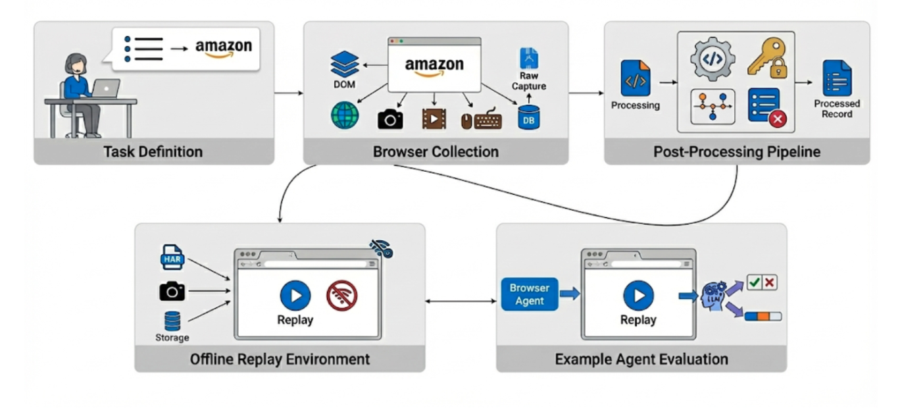
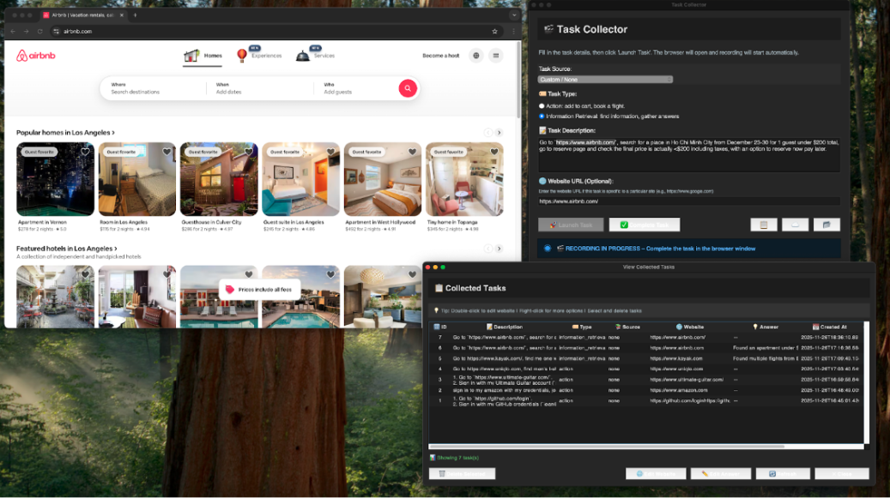
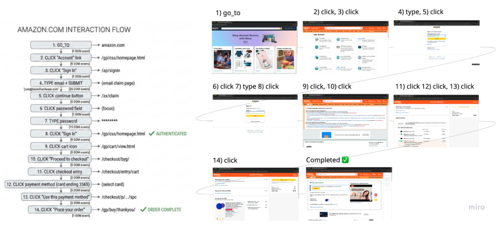

# Position: Web Agent Research Needs Capture-Replay Infrastructure, Not More Handcrafted Replicas

---

## Abstract

**This is a position paper.** We argue that web agent research should replace handcrafted website replicas with capture-replay infrastructure that turns real expert demonstrations into reusable, offline environments. Current benchmarks require heavy engineering yet cover a narrow, economically unrepresentative slice of web work, while proprietary environment providers concentrate access. Capture-replay offers a scalable alternative: a single expert session can produce a complete environment in minutes, grounded in real workflows and shareable via open-source tooling. We analyze the benchmark landscape and its cost structure, and present TRACE, a proof-of-concept pipeline that works on production sites including authenticated flows. We discuss limitations (reduced exploration, legal and ethical constraints, and replay determinism) and argue they are tractable through additional collection and community norms. We conclude with a call to action to redirect investment away from handcrafted replicas and toward capture-replay, and to document environment construction costs to enable fair methodological comparisons.

---

## 1. Introduction

> *"Web agents are hill climbing in the wrong direction."*

The past two years have witnessed remarkable progress in language-model agents for web and computer use. Systems built on frontier models can now navigate complex websites, fill forms, execute multi-step workflows, and retrieve information across diverse domains [1-11]. Benchmarks such as Mind2Web, WebArena, WebVoyager, WorkArena, REAL, OSWorld, BEARCUBS, BrowseComp, and TheAgentCompany have provided standardized evaluation environments that enable reproducible comparisons and have driven rapid capability improvements [1-10,24,25].

Yet beneath this progress lies a troubling structural problem: **the environments we use to train and evaluate web agents bear little resemblance to the tasks that would make these agents economically valuable.** The majority of benchmark tasks fall into categories we characterize as "deep research" (trivia-style multi-hop questions that rarely require browser automation), "information seeking" (simple lookups that could often be answered by a search engine), or "atomic execution" (short, isolated actions like clicking a button or filling a single field). Long-horizon, multi-step workflows that mirror real paid work (booking complex travel itineraries, configuring enterprise SaaS tools, executing financial transactions, managing e-commerce operations) remain dramatically underrepresented. More importantly, most benchmarks are not collected from people doing paid work; they are task templates designed for evaluability rather than traces of real economic activity.

This is not an oversight. It reflects a fundamental constraint: **handcrafted environments are extraordinarily expensive to build.**

Consider the costs documented in recent benchmark papers:

| Benchmark       | Tasks | Reported Effort                                                                                                            |
| --------------- | ----- | -------------------------------------------------------------------------------------------------------------------------- |
| WebArena        | ~812  | Several months of development by research team; requires self-hosting four functional website replicas                     |
| OSWorld         | ~369  | Hand-annotated tasks each requiring initial state scripting and custom evaluation functions                                |
| TheAgentCompany | ~175  | **3,000 person-hours by 21 contributors** over two months; some tasks took 10+ hours each to design, implement, and verify |
| REAL            | ~112  | Deterministic replicas of 11 real websites with custom evaluation harnesses                                                |

TheAgentCompany's transparent reporting is particularly illuminating: building 175 realistic "employee-style" tasks required 3,000 person-hours, the equivalent of 1.5 full-time engineers working for an entire year. The project involved 21 contributors including software engineers and project managers, with complex tasks requiring more than 10 hours each to design, implement, test, and verify. And these are among the most resource-rich academic teams in the field.

**The implication is stark:** at current construction costs, the academic community cannot build environments at the scale needed to cover the long tail of economically valuable browser tasks. We can produce hundreds of tasks, perhaps low thousands with extraordinary effort, but the space of valuable web workflows spans millions of distinct patterns across hundreds of thousands of websites.

These costs are not only financial. They consume scarce research time that could otherwise go toward agent design, failure analysis, and iteration. And because realistic environment construction is so expensive, evaluation suites remain small and often collapse to binary success metrics, which limits error analysis and makes it difficult to diagnose where, why, and how models fail.

This gap has not gone unnoticed by industry. A growing ecosystem of startups now builds browser environments for AI agent training [15-18]. The business models vary: some host live environments, others deliver static datasets, and some offer both. What they share is a focus on creating replica websites and simulated workflows where AI agents can learn through reinforcement learning without triggering blocking mechanisms on real sites.

The scale of investment is remarkable. According to The Information, Anthropic has discussed spending more than \$1 billion on RL environments over the next year [26]. Data-labeling giants like Scale AI, Surge, and Mercor are pivoting resources toward environment construction, with Surge reportedly generating \$1.2 billion in revenue last year from AI lab contracts and recently spinning up a dedicated internal organization for RL environments [26]. Mechanize, a startup focused exclusively on environments, offers software engineers \$500,000 salaries to build them—far higher than typical data-labeling contractor rates [26]. Andreessen Horowitz general partner Jennifer Li summarized the landscape: "All the big AI labs are building RL environments in-house... but AI labs are also looking at third-party vendors that can create high-quality environments" [26].

Leading AI labs treat these environments as core training infrastructure. **Browser environments have become a strategic asset: valuable, proprietary, and concentrated in the hands of well-funded organizations.**

We believe this trajectory is problematic for the field. When the ability to train and iterate on realistic web agents depends on access to expensive proprietary infrastructure, the research community's capacity for independent investigation is constrained. Open science suffers. Reproducibility suffers. And the concentration of capability in a small number of actors raises broader concerns about the development trajectory of increasingly powerful autonomous systems. This issue affects not only academic groups, but also open-source LM companies operating on budgets that are tiny relative to frontier labs.

**This paper argues for an alternative approach: capture-replay.**

The core idea is simple: rather than handcrafting website replicas, we record an expert completing a task on a live website and transform that recording into a self-contained environment that can be replayed offline. A single expert demonstration (taking minutes to perform) produces a complete environment bundle including DOM states, network responses, screenshots, and interaction logs. Agents can then be evaluated (and potentially trained) against this frozen snapshot without contacting the live web.

Capture-replay is not a new concept in software engineering. Record-and-replay debugging, network mocking, and browser automation testing have used similar techniques for decades. But its application to web agent research has been surprisingly limited. We argue this represents a significant missed opportunity.

To demonstrate feasibility, we developed TRACE (Trajectory Recording and Capture Environments), an open-source capture-replay pipeline. Building robust tooling required approximately 300 hours of engineering effort—analyzing hundreds of captured sessions, developing URL canonicalization heuristics, and iterating on replay matching. But once built, the tooling amortizes: we captured six diverse environments (GitHub, Amazon, Airbnb, Kayak, Uniqlo, Ultimate Guitar) in approximately 40 minutes of total collection time, including retries and quality checks. This is roughly 6-7 minutes per task versus the 10+ hours per task reported for handcrafted benchmarks like TheAgentCompany.

**Our position, stated precisely:**

> **The web agent research community should replace handcrafted replicas with capture-replay infrastructure. With sufficient capture breadth and tooling, capture-replay can deliver the determinism and coverage researchers want without the human-capital cost of hand-built replicas.**

We emphasize "replace" deliberately. Handcrafted replicas consume scarce human capital and are not required to achieve determinism, controlled variation, or breadth. Those properties can be achieved by capture-replay at scale: multi-trajectory collection, record-on-miss expansion, and post-processing that enables controlled perturbations. The community's near-exclusive focus on replicas has slowed progress and narrowed evaluation; we argue the field should move past them.

The remainder of this paper develops this argument in detail:

- **Section 2** presents a taxonomy of existing benchmarks, revealing systematic gaps in economically valuable task coverage and analyzing the cost structure of current approaches.
- **Section 3** articulates the case for capture-replay, describing its potential advantages and presenting TRACE as a proof-of-concept implementation.
- **Section 4** addresses alternative views and counterarguments, including concerns about exploration latitude, legal and ethical considerations, and technical feasibility.
- **Section 5** presents a concrete call to action with specific recommendations for researchers, benchmark creators, and the broader community.

---

## 2. The Current Landscape: Expensive Replicas, Limited Coverage

### 2.1 A Taxonomy of Browser Agent Benchmarks

To understand the current state of web agent environments, we systematically analyzed eleven prominent benchmarks across three dimensions: **task category** (what kind of work the agent performs), **task horizon** (how many steps or how much time tasks typically require), and **economic grounding** (whether tasks resemble work someone would pay to have completed).

| Benchmark          | Category                 | Horizon      | Economic Grounding | Key Limitation                                                     |
| ------------------ | ------------------------ | ------------ | ------------------ | ------------------------------------------------------------------ |
| GAIA [4]           | Deep research            | Medium       | Low                | General-assistant QA; many tasks are not web-specific or action-based |
| BEARCUBS [1]       | Info seeking             | Short-Medium | Low                | QA-only; no state-changing actions; small task set (111)           |
| BrowseComp [2]     | Deep research            | Long         | Low                | QA-only; short answers; open-web drift                             |
| Mind2Web 2 [6]     | Deep research            | Long         | Low                | Agentic search QA; LLM-as-judge evaluation                         |
| Mind2Web [5]       | Info seeking / Execution | Short-Medium | Medium             | Live-web trajectories; action-matching evaluation; no deterministic env |
| WebVoyager [24]    | Info seeking / Execution | Medium       | Low-Medium         | Live websites; GPT-4V-based eval; limited domain coverage          |
| WebArena [7]       | Execution                | Medium       | Medium             | Replica sites; limited domains; high construction cost             |
| REAL [8]           | Execution                | Short-Medium | Medium-High        | Deterministic replicas; limited task count and domains             |
| OSWorld [9]        | Execution                | Short-Medium | Medium             | Desktop-focused; heavy state setup and evaluators                  |
| WorkArena [25]     | Execution                | Short-Medium | High               | Single platform (ServiceNow); small task set (33); remote-hosted   |
| TheAgentCompany [10] | Execution             | Medium       | High               | Realistic workflows but extraordinarily expensive to build         |

**Table 1:** Taxonomy of existing web agent benchmarks. We observe a clear pattern: benchmarks with high economic grounding (TheAgentCompany, WorkArena, parts of REAL) require the most construction effort, while scalable benchmarks (Mind2Web, BrowseComp) tend toward tasks with limited economic value.

Several patterns emerge from this analysis:

**Pattern 1: The effort-value tradeoff.** Benchmarks that emphasize economically realistic tasks (TheAgentCompany, WorkArena, REAL) require dramatically more construction effort than those emphasizing information retrieval or synthetic reasoning (BrowseComp, GAIA). This is not coincidental. Realistic execution tasks require functional environments with state that actually changes, authentication flows that work, and evaluation criteria that verify real outcomes.

**Pattern 2: Horizon compression.** Even benchmarks labeled as "long-horizon" often consist of relatively short interaction sequences when measured in actual steps. Mind2Web 2 explicitly analyzed this phenomenon, finding that most existing benchmarks concentrate on short-horizon tasks [6]. Long-horizon, multi-session workflows that characterize real knowledge work remain rare.

**Pattern 2.1: Horizon costs explode.** As agents improve, the field is pushing toward longer-horizon evaluations (e.g., METR's work on measuring ability to complete long tasks [23]). But handcrafting long-horizon tasks scales poorly: if some tasks already require 10+ hours to design and verify, the idea of 12-hour, multi-day, or week-long workflows is untenable. Replica construction cannot keep pace with the horizon lengths we need to measure.

**Pattern 3: Domain concentration.** Existing benchmarks heavily favor a small set of domains: e-commerce, content management, developer tools, and travel booking appear repeatedly, while vast categories of economically important web work (financial services, healthcare portals, government services, enterprise SaaS, professional services) remain largely uncovered.

**Pattern 4: The live-web evaluation problem.** Benchmarks that evaluate on live websites (Mind2Web, BrowseComp, BEARCUBS, WebVoyager) face continuous validity challenges as the web changes. Those that avoid this through replicas (WebArena, REAL) gain reproducibility but lose coverage and realism.

### 2.2 The Cost Structure of Environment Construction

Why are realistic browser environments so expensive to build? The costs compound across multiple dimensions:

**Website replication costs.** Creating a functional replica of even a moderately complex website requires reverse-engineering its interaction model, implementing sufficient backend logic to respond meaningfully to agent actions, and maintaining consistency as the original site evolves. REAL's approach (deterministic simulations of 11 real websites) required building custom evaluation harnesses that mix programmatic checks with LLM-based judgment [8].

**State initialization costs.** Realistic tasks often require specific preconditions: items in a shopping cart, emails in an inbox, projects configured in a particular way. OSWorld's task suite required extensive scripting to establish correct initial states for each of its 370 tasks [9]. TheAgentCompany built an entire simulated company environment with interconnected services [10].

**Evaluation complexity costs.** When tasks have multiple valid solutions or require judgment about partial completion, evaluation itself becomes a substantial engineering challenge. The field has increasingly turned to LLM-as-a-judge approaches, but these introduce their own costs, biases, and reproducibility concerns [12].

**Maintenance costs.** The web changes constantly. Benchmarks evaluated on live sites require ongoing curation to verify task validity. Replica-based benchmarks must track upstream changes if they aim to remain representative.

**Credential and access costs.** Many economically valuable tasks require authenticated access to real services. Benchmarks either avoid these tasks, use synthetic accounts with limited functionality, or require evaluators to provide their own credentials. Each approach constrains coverage or reproducibility.

### 2.3 The Concentration of Environment Access

The expense of environment construction has predictable consequences for who can build and access high-quality environments.

As discussed above, a commercial ecosystem has emerged to fill this gap [15-18]. These providers offer browser environments through various models: some host live replicas, others deliver packaged datasets, and some provide both. The environments enable something impossible on real websites: running thousands of AI agents simultaneously through trial-and-error learning without being blocked.

Leading AI labs use these commercial environments for training and evaluating their web agents. As frontier labs have exhausted most available text data for pretraining, reinforcement learning in simulated environments has become increasingly important. With per-task costs in the thousands to tens of thousands of dollars, these environments represent substantial investments, but ones that well-capitalized organizations can afford while academic groups generally cannot.

We also see this dynamic inside product companies building agents for their own products: teams are spun up to build replicas of their own UIs and workflows so they can train and evaluate at scale. This is yet another signal that handcrafted environments are expensive, bespoke infrastructure, not a sustainable research path.

These training environments are typically proprietary and contract-bound, making it hard for open-source and academic research to access or reproduce the training conditions that drive frontier results.

**The result is a two-tier system:** well-funded labs train agents on high-quality, realistic environments that they cannot share, while the academic community and open-source LM companies work primarily with the limited set of open benchmarks. This concentration raises concerns about:

1. **Reproducibility:** If state-of-the-art results depend on proprietary training environments, the research community cannot fully verify or build upon them.
2. **Diversity:** Concentrated environment access may lead to agents that excel on specific task distributions while failing on the broader diversity of real-world needs.
3. **Safety:** Independent safety research requires access to the same environments used for capability development; concentration of access constrains this.

---

## 3. The Case for Capture-Replay

### 3.1 Core Concept

Capture-replay inverts the environment construction process. Rather than building a website replica and then defining tasks on it, we:

1. **Capture:** An expert performs a real task on a live website while an instrumented browser records everything: DOM states, network traffic, user interactions, screenshots, and video.

2. **Process:** A post-processing pipeline transforms raw captures into clean, reusable artifacts: high-level action sequences (a standardized tool-call DSL), extracted credentials (for secure handling), semantic checkpoints (for partial-credit evaluation), and filtered network logs (removing analytics and non-essential traffic).

3. **Replay:** A replay engine serves the captured assets locally, allowing agents to interact with a frozen snapshot of the original session without contacting the live web.

This approach offers several structural advantages:

### 3.2 Advantage 1: Scalability

The most significant advantage of capture-replay is speed. **A single expert demonstration produces a complete environment in the time it takes to perform the task.**

Our proof-of-concept implementation (TRACE) captured six diverse tasks across GitHub, Amazon, Airbnb, Kayak, Uniqlo, and Ultimate Guitar in about 40 minutes of total collection time including retries (about 6:40 per task). Each capture produced hundreds of HTTP responses, dozens of DOM snapshots, and complete interaction logs. These are artifacts that would require days or weeks to handcraft.

This changes the economics of environment construction fundamentally. At capture-replay speeds:

- A single researcher could produce hundreds of environments per week
- Crowdsourced collection becomes feasible (we built a desktop app for non-technical collectors)
- The long tail of websites becomes accessible: any site an expert can use can become an environment

### 3.3 Advantage 2: Economic Grounding

Capture-replay environments are grounded in real tasks by construction. When an expert books an actual flight, configures a real SaaS tool, or completes a genuine e-commerce transaction, the resulting environment captures a workflow that someone demonstrably values enough to perform.

This contrasts with the synthetic task design required for replica-based benchmarks, where researchers must imagine what tasks would be valuable and then construct environments to support them. The imagination often falls short of reality: we design tasks we can evaluate rather than tasks that matter.

Capture-replay enables a different paradigm: **find people doing economically valuable work, record them, and build environments from their actual workflows.** This could connect web agent research more directly to real productivity gains.

### 3.4 Advantage 3: Democratization

Open-source capture-replay tooling can break the concentration of environment access. Any researcher with a browser can record environments from any website they can access. No proprietary infrastructure required, no licensing fees, no vendor lock-in.

This is not merely theoretical. TRACE is released as open-source software (URL redacted for double-blind review), and its captured environments are published on a public dataset host (URL redacted for double-blind review). The tooling is designed for extensibility: researchers can adapt it to their domains, contribute improvements, and build shared infrastructure without depending on commercial providers.

### 3.5 TRACE: A Proof of Concept

To demonstrate that capture-replay is technically feasible on modern production websites, we developed TRACE (Trajectory Recording and Capture Environments), an open-source pipeline implementing the full capture-process-replay workflow. Implementation details are provided in Appendix A.

**Collection.** TRACE uses a stealth-configured Playwright browser that evades common anti-automation detection while recording comprehensive traces. During recording, TRACE captures:
- Navigation events and page loads
- DOM mutations and full page snapshots
- Mouse, keyboard, and scroll interactions
- HTTP requests and responses (HAR format)
- Screenshots and video frames
- Browser storage states (cookies, localStorage, IndexedDB)

**Post-processing.** Raw captures are transformed through four pipeline stages:
1. **Tool-call parsing:** Low-level events are converted to a standardized DSL (click, type, scroll, goto, etc.), producing human-readable trajectories.
2. **Credential extraction:** Login flows and sensitive inputs are identified and extracted to separate secure storage, enabling credential substitution for sharing.
3. **Checkpoint selection:** An LM-based system identifies semantically meaningful intermediate states for partial-credit evaluation.
4. **Ignore-list construction:** Analytics, tracking, and non-essential network traffic is identified for filtering during replay.

**Replay.** The replay module launches offline environments from capture bundles:
- All network responses served from captured HAR files
- Character-based URL matching handles dynamic parameters
- LM-based disambiguation resolves ambiguous request matches
- Storage state restoration enables authenticated replays
- Human trajectory execution for visual debugging


**Demonstration dataset.** We release six captured environments covering:
- **GitHub** (authenticated): Sign in, star repository, search and follow user
- **Amazon** (authenticated): Sign in, navigate deals, add to cart, proceed to checkout
- **Ultimate Guitar** (authenticated): Sign in, search tabs, interact with content
- **Uniqlo** (unauthenticated): Browse products, apply filters, add to cart
- **Kayak** (unauthenticated): Search flights, apply filters, compare results
- **Airbnb** (unauthenticated): Search listings, apply filters, view details

These environments demonstrate feasibility across diverse sites including credentialed flows with sensitive interactions (payments, personal data). Each replays fully offline with high determinism across runs when deterministic matching and cached decisions are used.

We emphasize that this dataset is intentionally small. Six tasks is insufficient for benchmark-scale evaluation. TRACE is offered as proof of concept and infrastructure contribution, not as a complete benchmark. The point is demonstrating that capture-replay works, not claiming comprehensive coverage.

---

## 4. Alternative Views and Counterarguments

A position paper must engage seriously with opposing views. We address the most significant counterarguments to capture-replay:

### 4.1 "Capture-replay limits agent exploration"

**The concern:** Replica-based environments allow agents to explore freely: taking different paths, making mistakes, recovering from errors. Captured environments are constrained to the specific trajectory recorded; if an agent deviates, the replay may lack the network responses needed to continue.

**Our response:** This is not a fundamental limitation. The low cost of collection makes coverage of alternative paths a data problem, not an environment-construction problem. Two practical mechanisms address exploration directly:

1. **Multi-trajectory collection.** Capture multiple expert paths for the same task. These provide recovery behaviors and legitimate alternatives without any hand-built replica.

2. **Deterministic branching for exploration.** Replay can expose captured branches deterministically, allowing beam-search-style exploration over alternative paths. When an agent hits a missing branch, record-on-miss collection adds it and expands the environment.

In short, exploration constraints are solvable with more capture and deterministic branching, not a reason to keep handcrafted replicas.

### 4.2 "Legal and ethical concerns around captured content"

**The concern:** Capturing and redistributing website content raises legal questions (copyright, terms of service) and ethical questions (privacy, consent, potential for misuse).

**Our response:** These concerns are legitimate and require careful attention. We advocate for:

1. **Credential extraction and substitution.** TRACE's pipeline separates credentials from captured content, allowing environments to be shared without exposing real passwords or tokens. Evaluation harnesses inject credentials at runtime.

2. **PII redaction.** Post-processing should identify and redact personally identifiable information beyond credentials, including names, addresses, and payment details visible in page content.

3. **Restricted distribution.** Not all captured environments should be publicly released. Research-use agreements, access controls, and clear licensing can balance openness with responsibility.

4. **Ethical guidelines.** The community should develop shared norms around what captures are appropriate to create and share. We propose concrete guidelines in Appendix C covering authorization, sensitive data handling, distribution tiers, and misuse prevention.

5. **Terms of service consideration.** While ToS compliance is complex and varies by jurisdiction, researchers should consider whether their capture and use patterns align with reasonable interpretations of site policies.

**Importantly, replica-based benchmarks face analogous concerns that are often overlooked.** WebArena clones the visual design and interaction patterns of Reddit, GitLab, and shopping sites. REAL builds "deterministic simulations" that reproduce real website behavior. These replicas copy copyrighted UI designs, reverse-engineer proprietary interaction models, and redistribute structural representations of commercial products. The legal status of benchmark environments is unsettled regardless of methodology. Capture-replay does not introduce novel legal risk categories; it inherits the same ambiguities that replica builders have navigated (often silently) for years. The difference is that capture-replay makes the provenance explicit, which may actually support clearer fair-use arguments for research purposes.

### 4.3 "LM-based matching introduces non-determinism"

**The concern:** TRACE uses LM-based disambiguation when multiple captured responses match an outgoing request. This introduces potential non-determinism across evaluation runs.

**Our response:** The LLM matcher is a proof-of-concept convenience, not a requirement. In principle, request matching should be fully deterministic for most websites by canonicalizing and matching on method, URL (scheme/host/path + normalized query), and request body parameters. Ambiguities can be resolved by strict tie-breakers (e.g., exact header matches, body hashes, or earliest-capture precedence) without model calls. A production system should default to deterministic matching and treat LLMs, if used at all, as a last-resort debugging tool.

### 4.4 "Six tasks doesn't prove scalability"

**The concern:** A proof-of-concept with six tasks doesn't demonstrate that capture-replay can scale to benchmark-sized collections or handle the diversity of the web.

**Our response:** Correct. Six tasks demonstrates technical feasibility, not scale. We claim only that capture-replay *can* work, not that we have built a complete benchmark.

However, we note:

1. **The time investment was minimal.** Six environments in about 40 minutes of total collection time (about 6:40 per task) suggests that hundreds are achievable with modest effort.

2. **Diversity was intentional.** We selected sites spanning e-commerce, social coding, travel, retail, and entertainment to demonstrate breadth.

3. **Challenging cases were included.** Authenticated flows, payment interactions, and dynamic content (map interfaces, infinite scroll) are represented.

4. **The small task count belies substantial engineering investment.** Building TRACE required approximately 300 hours of engineering effort: not to create six tasks, but to develop robust tooling that generalizes across sites. This involved analyzing hundreds of captured sessions to understand request patterns, developing URL canonicalization heuristics that handle diverse parameter schemes, building credential detection that works across varied login flows, and iterating on replay matching until it achieved high fidelity. The six released tasks are the validation that this infrastructure works; the infrastructure itself is the contribution. Once built, adding new environments becomes a matter of minutes per task rather than days.

5. **Scaling is now an engineering challenge, not a research question.** Given working tooling, collecting more environments requires time and experts, not methodological breakthroughs.

We welcome the community to stress-test capture-replay at larger scales and report findings.

### 4.5 "Handcrafted replicas are necessary for controlled studies"

**The concern:** Certain research questions (robustness to perturbations, controlled ablations, systematic variation) require the control that only handcrafted environments provide.

**Our response:** We disagree. With sufficient capture breadth and tooling, capture-replay can support controlled studies without hand-built replicas:

1. **Multi-trajectory collections** provide alternative valid paths and recovery behaviors.
2. **Record-on-miss expansion** covers new branches by capturing additional sessions rather than engineering a replica.
3. **Post-processing and parameterization** can create controlled perturbations (DOM edits, resource swaps, replay-time filtering) while preserving fidelity to real websites.
4. **Deterministic replay** already provides the reproducibility needed for ablations.

We have not found a research question that strictly requires handcrafted replicas; the human-capital cost is not justified relative to capture-replay.

### 4.6 "If capture-replay works, why do commercial environment providers exist?"

**The concern:** Companies charge $3,000 to $50,000 per task for browser environments. These are sophisticated actors with access to the same techniques. If capture-replay were sufficient, why would labs pay these prices?

**Our response:** Commercial providers do use capture-replay methods. They are not building environments from scratch. Their value proposition is scale, customization, and handling the tedious engineering that most teams cannot or will not do.

Building robust capture-replay infrastructure is genuinely hard. TRACE required approximately 300 hours of engineering effort, involving pattern analysis across hundreds of websites, iterative refinement of URL canonicalization heuristics, debugging replay failures across diverse site architectures, and developing detection logic that generalizes beyond individual sites. This is tedious, unglamorous work that does not produce publishable research artifacts, exactly the kind of work that commercial providers monetize.

The existence of commercial providers does not invalidate capture-replay; it validates that capture-replay is the underlying methodology. What providers sell is the engineering labor to make it work reliably at scale, plus customization layers (parameterized variations, API integrations, guaranteed coverage). Our argument is that this engineering should be done once and shared openly, not replicated behind paywalls at every organization. TRACE is a step toward that shared infrastructure.

### 4.7 "Capture-replay works for evaluation but not training"

**The concern:** Evaluation only requires replaying a frozen trajectory: the agent either matches the expected path or it doesn't. Training via reinforcement learning requires exploration, trial-and-error, and feedback from mistakes. Captured environments cannot provide negative rewards for failed actions or support recovery from off-trajectory states.

**Our response:** TRACE is currently validated for evaluation, not RL training, but we see no fundamental barrier to training use, only engineering and data scale challenges. Notably, handcrafted replicas face the same challenge: supporting diverse exploration paths requires either engineering every possible interaction (expensive) or accepting limited coverage. The difference is that capture-replay can expand coverage in minutes per trajectory, while replicas require significant engineering effort per new behavior. We note that while details remain proprietary, commercial environment providers appear to use capture-based methods (not pure handcrafted replicas) to achieve faster environment generation, suggesting the industry has already moved in this direction.

Consider what multi-trajectory capture-replay actually provides:

1. **A graph of valid transitions, not a single path.** With sufficient trajectory diversity, captured environments form a state-action graph where agents can explore different branches. This is structurally similar to what offline RL and batch RL methods are designed for: learning from fixed datasets of transitions without live environment interaction.

2. **Graded reward signals via checkpoints.** TRACE's checkpoint system enables partial-credit feedback: agents receive reward for reaching intermediate states even if they fail the final goal. The captured human trajectory serves as a heuristic for progress, providing denser reward signal than binary success/failure.

3. **Imitation learning and behavioral cloning.** Captured expert demonstrations are directly usable for imitation learning approaches. The high-fidelity action sequences and DOM states provide supervision signal for learning from demonstration without requiring environment interaction at all.

4. **Record-on-miss expansion for coverage.** When agents hit uncaptured branches during training, the missing transitions can be recorded and added to the environment, progressively expanding the explorable state space.

The key question is data scale: how many trajectories are needed to provide sufficient exploration coverage for effective RL? This is an empirical question we have not yet answered. But the offline RL literature demonstrates that learning from fixed trajectory datasets is viable; capture-replay provides exactly such datasets grounded in real websites.

We also note that **evaluation is the more urgent bottleneck.** Most academic groups cannot evaluate on realistic long-horizon tasks at all because the environments simply do not exist. Capture-replay addresses this evaluation crisis immediately, while training applications require further research and scale.

### 4.8 "The modern web actively resists being captured"

**The concern:** Websites deploy sophisticated anti-automation measures: CAPTCHA challenges, bot detection services (Cloudflare, PerimeterX, DataDome), device fingerprinting, behavioral analysis, and rate limiting. Captured sessions may fail to replay if tokens expire, CSRF protections trigger, or fingerprints mismatch.

**Our response:** This is true, and it is one of the primary reasons TRACE required such substantial engineering effort. The modern web is hostile to automation, and this hostility extends to legitimate research use cases.

We found that:

1. **Many high-value sites are capturable with sufficient engineering.** Stealth browser configuration, realistic interaction timing, and careful session management enabled successful capture across all six demonstration sites, including major platforms with known anti-bot measures.

2. **Anti-bot measures vary widely in sophistication.** Some sites block naive automation immediately; others permit careful automated access. The landscape is heterogeneous, not uniformly hostile.

3. **Replay is often easier than capture.** Once traffic is captured, replay serves responses locally without contacting the live site. Anti-bot measures that trigger on request patterns do not apply to offline replay.

4. **This is an ongoing arms race.** We do not claim that all sites are capturable or that current techniques will work indefinitely. Anti-automation technology continues to evolve.

We view anti-bot resistance as a practical obstacle that increases engineering cost, not a fundamental barrier that invalidates capture-replay. The question is whether the engineering investment is lower than handcrafting replicas. We believe it is, especially when tooling is shared.

### 4.9 "Frozen captures do not generalize to live sites"

**The concern:** A model evaluated on captures from January 2025 may fail on the same site in March 2025 when UI layouts change, API endpoints shift, or authentication flows update. Performance on frozen captures may not predict performance on live sites.

**Our response:** This is a genuine limitation that we do not attempt to dismiss.

Capture-replay trades temporal validity for reproducibility and cost efficiency. A captured environment is a snapshot: it enables reproducible evaluation and apples-to-apples comparison between agents, but it does not guarantee that results transfer to the live web at a different point in time.

We offer three observations:

1. **Replica-based benchmarks face the same problem.** WebArena's Reddit clone does not track Reddit's actual UI evolution. REAL's "deterministic simulations" are frozen at their creation date. The web changes; all offline benchmarks lag.

2. **Reproducibility has independent value.** Even if capture-to-live transfer is imperfect, the ability to compare agents on identical environments enables scientific progress. Reproducible evaluation on frozen captures is more valuable than irreproducible evaluation on live sites that change between runs.

3. **Periodic recapture can track drift.** Unlike replicas that require substantial rework to update, capture-replay environments can be refreshed by simply recording new sessions. A quarterly recapture cadence could maintain reasonable temporal validity with modest ongoing effort.

We call for empirical research measuring capture-to-live transfer. This is an open question that the community should investigate rather than assume answers to.

---

## 5. Call to Action

We conclude with specific recommendations for different stakeholders:

### 5.1 For Research Groups and Open-Source LM Companies

1. **Redirect resources away from replica construction.** Stop building new handcrafted replicas and invest in capture-replay tooling and collection capacity.

2. **Collect domain-specific environments.** Research groups with expertise in particular domains (finance, healthcare, enterprise software) can capture environments that would be difficult for generalist teams to construct.

3. **Publish captured environments with appropriate safeguards.** Share environments under research-use licenses with credential substitution and PII redaction. Document capture methodology for reproducibility.

4. **Expand capture breadth.** Use record-on-miss, multi-trajectory collection, and replay-time perturbations to expand exploration latitude without handcrafted replicas.

### 5.2 For Benchmark Creators

1. **Document environment construction costs.** Transparent reporting of person-hours, like TheAgentCompany's exemplary disclosure, enables informed methodology comparisons. We recommend all benchmark papers include this information.

2. **Adopt capture-replay for evaluation suites.** Replace new replica-based benchmarks with capture-replay collections to scale coverage and enable deeper error analysis.

3. **Plan migrations from replicas.** For existing replica-based suites, publish a capture-replay transition plan and a timeline for deprecating handcrafted environments.

4. **Establish shared infrastructure.** Coordinate on common tooling, formats, and distribution mechanisms for captured environments to reduce duplication and enable interoperability.

### 5.3 For the Broader Community

1. **Develop ethical guidelines for environment capture.** What consent is required? What content can be redistributed? What safeguards are necessary? Community norms would benefit all practitioners.

2. **Create registries of captured environments.** Centralized, searchable collections would reduce duplication and enable broader access. Hugging Face and similar platforms could host these.

3. **Pressure commercial providers toward openness.** Encourage environment platforms to release subsets of their collections for research use, or to adopt open standards that reduce lock-in.

4. **Investigate legal frameworks.** Clearer understanding of copyright, ToS, and data protection implications would benefit the entire field. Legal scholarship on AI training data has relevant precedents.

### 5.4 Concrete Next Steps

For those convinced by our argument, we suggest immediate actions:

1. **Try TRACE.** Clone the repository, capture an environment from a website you use, replay it offline. Experience the workflow firsthand.

2. **Identify valuable tasks in your domain.** What browser workflows would genuinely save time or money if automated? These are candidates for capture.

3. **Contribute to shared infrastructure.** Submit captured environments to public registries. Report issues with capture tooling. Propose improvements to post-processing pipelines.

4. **Advocate within your organization.** If you work at a lab with access to commercial environments, advocate for releasing research subsets or contributing to open alternatives.

---

## 6. Conclusion

The web agent research community has made real progress, but handcrafted replicas are now the bottleneck. They are slow and expensive to build, lock us into small, synthetic task sets, and collapse evaluation to binary success. As task horizons stretch to hours and days, replica construction becomes untenable, and the ecosystem splits into a two-tier system where only well-funded labs and product companies can afford realistic environments.

Capture-replay replaces that bottleneck with fast, economically grounded environments collected from real work. Deterministic replay, multi-trajectory collection, and branching give us coverage and analysis depth without hand-built replicas. The remaining challenges are about collection logistics and responsible sharing, not environment engineering.

**Our position, restated:** The web agent research community should replace handcrafted replicas with capture-replay infrastructure. Stop building new replicas, invest in capture tooling and large-scale collection, and standardize sharing so long-horizon, economically valuable tasks become accessible to everyone. The tools exist; the decision is whether we continue paying the replica tax or move the field forward.

---

## References

[1] Song, Y., et al. "BEARCUBS: A Benchmark for Computer-Using Web Agents." arXiv:2503.07919, 2025.

[2] Wei, J., et al. "BrowseComp: A Simple Yet Challenging Benchmark for Browsing Agents." arXiv:2504.12516, 2025.

[3] Murty, S., et al. "NNetNav: Unsupervised Learning of Browser Agents Through Environment Interaction in the Wild." arXiv:2410.02907, 2024.

[4] Maia, M.J.A., et al. "GAIA: A Benchmark for General AI Assistants in the Wild." arXiv:2311.12983, 2023.

[5] Zhang, C., et al. "Mind2Web: Toward a Generalist Agent for the Web." arXiv:2306.06070, 2023.

[6] Li, Z., et al. "Mind2Web 2: Evaluating Agentic Search with Agent-as-a-Judge." arXiv:2506.21506, 2025.

[7] Zhou, S., et al. "WebArena: A Realistic Web Environment for Building Autonomous Agents." arXiv:2307.13854, 2023.

[8] Garg, D., et al. "REAL: Benchmarking Autonomous Agents on Deterministic Simulations of Real Websites." arXiv:2504.11543, 2025.

[9] Xie, T., et al. "OSWorld: Benchmarking Multimodal Agents for Open-Ended Tasks in Real Computer Environments." arXiv:2404.07972, 2024.

[10] Xu, F.F., et al. "TheAgentCompany: Benchmarking LLM Agents on Consequential Real World Tasks." arXiv:2412.14161, 2024.

[11] Feng, Y., et al. "BrowserAgent: Grounded Test-Time Adaptation for Web Agents." arXiv:2510.10666v2, 2025.

[12] Xue, T., et al. "An Illusion of Progress? Assessing the Current State of Web Agents." arXiv:2504.01382, 2025.

[13] Murty, S., et al. "Agent Learning via Early Experience: Generalist Web Agents with Temporal Credit Assignment." arXiv:2510.08558, 2025.

[14] Jiang, L., et al. "Beyond Browsing: API-Based Web Agents." Findings of ACL 2025.

[15] Mechanize. https://www.mechanize.work

[16] Plato. https://plato.so

[17] AGI Inc. https://agi.inc

[18] Kaizen. https://www.kaizenautomation.com

[19] OpenAI. "GDPval: Evaluating AI Model Performance on Real-World Economically Valuable Tasks." arXiv:2510.04374.

[20] Ramaswamy, S., et al. "SWE-Lancer: Benchmarking LLMs on Freelance Software Engineering Tasks." arXiv:2502.12115.

[21] Deng, J., et al. "WebShop: Towards Scalable Real-World Web Interaction with Grounded Language Agents." arXiv:2207.01206, 2022.

[22] SkillWeaver authors. "SkillWeaver: Self-Improving Web Agents via Skill Discovery and Reuse." arXiv:2504.07079, 2024.

[23] METR. "Measuring AI Ability to Complete Long Tasks." https://metr.org/blog/2025-03-19-measuring-ai-ability-to-complete-long-tasks/

[24] He, H., et al. "WebVoyager: Building an End-to-End Web Agent with Large Multimodal Models." arXiv:2401.13919, 2024.

[25] Drouin, A., et al. "WorkArena: How Capable Are Web Agents at Solving Common Knowledge Work Tasks?" arXiv:2403.07718, 2024.

[26] Zeff, M. "Silicon Valley bets big on 'environments' to train AI agents." TechCrunch, September 21, 2025. https://techcrunch.com/2025/09/21/silicon-valley-bets-big-on-environments-to-train-ai-agents/

---

## Appendix A: TRACE Implementation Details

This appendix provides technical details on the TRACE implementation for researchers interested in understanding, extending, or reproducing the system. The complete source code is available at a URL redacted for double-blind review.


**Figure A1:** TRACE pipeline: collection, post-processing, offline replay, and agent evaluation.

### A.1 Collection Architecture

TRACE's collection system is built on Playwright with a stealth-configured Chromium browser designed to avoid anti-automation detection while maintaining full recording fidelity.

**Browser Configuration.** The collector launches Chromium with carefully selected arguments to evade bot detection:

```
--disable-blink-features=AutomationControlled
--disable-features=VizDisplayCompositor
--no-sandbox
--disable-web-security
--enable-automation=false
```

The context is configured with realistic defaults: 1366×768 viewport, `en-US` locale, `America/New_York` timezone, and standard HTTP headers including `Accept-Language`, `Sec-Fetch-*` headers, and geolocation permissions.

**Event Recording.** The `Recorder` class captures events across multiple categories:

| Event Category | Event Types                               | Trigger Conditions    |
| -------------- | ----------------------------------------- | --------------------- |
| State:Page     | `load`, `domcontentloaded`, `loaded`      | Page lifecycle events |
| State:Browser  | `navigated`, `navigate_start`, `back`     | Navigation events     |
| Action:User    | `click`, `input`, `contextmenu`, `submit` | User interactions     |

For each triggering event, the recorder captures:

1. **Accessibility Snapshot:** A YAML-formatted tree of up to 400 interactive elements extracted via Playwright's accessibility API, including element roles, names, ARIA attributes, and unique reference IDs.

2. **Screenshots:** Captured via Chrome DevTools Protocol (CDP) to avoid visual flicker, throttled to maximum one per 500ms to prevent duplicates.

3. **Network Traffic:** Full HAR (HTTP Archive) recording of all requests and responses, including headers, POST data, and response bodies (base64-encoded for binary content).

4. **Browser State:** Cookies, localStorage, sessionStorage, and IndexedDB snapshots captured at task completion.


**Figure A2:** Collecting a task using the Tkinter desktop app.

**Data Storage.** Each collection produces:

- SQLite database (`tasks.db`) with task metadata and step records
- Per-step DOM snapshots in `data/doms/task_{id}/step_{n}.txt`
- Screenshots in `data/screenshots/task_{id}/*.png`
- Video recordings in `data/videos/task_{id}/*.webm`
- Capture bundle in `data/captures/task_{id}/` containing:
  - `manifest.json`: Task metadata and resource index
  - `recording.har`: Complete HTTP archive
  - `storage/storage_state.json`: Browser storage snapshot
  - `resources/`: Cached static assets

### A.2 Post-Processing Pipeline

The post-processing pipeline transforms raw captures into clean, shareable artifacts through four sequential stages.

**Stage 1: Tool-Call Parsing.** Raw browser events are converted to a standardized Domain-Specific Language (DSL):

| DSL Action | Source Events                         | Parameters                                    |
| ---------- | ------------------------------------- | --------------------------------------------- |
| `go_to`    | `state:browser:navigated` (initial)   | `url`                                         |
| `click`    | `action:user:click`, `pointerdown/up` | `coordinates`, `element_info`, `navigates_to` |
| `type`     | `action:user:input`, `keydown`        | `value`, `submit`, `element_info`             |
| `scroll`   | `action:user:scroll`                  | `x`, `y` (absolute coordinates)               |

The parser handles event accumulation (e.g., multiple keydown events into a single `type` action), detects navigation consequences of clicks, and preserves DOM snapshot references for each action.

**Stage 2: Credential Extraction.** An LLM-based extractor (`gpt-5` with medium reasoning) identifies credential-related interactions by analyzing:

- Tool calls with `type` actions on login-related elements
- DOM context around input fields (labels, placeholders, ARIA descriptions)
- Navigation patterns indicating authentication flows

Extracted credentials are stored in a structured format:

```json
{
  "website": "amazon.com",
  "fields": [
    {"field_name": "email", "field_value": "user@example.com"},
    {"field_name": "password", "field_value": "[REDACTED]"}
  ],
  "tool_call_ids": [3, 4]
}
```

This separation enables credential substitution during sharing while preserving the trajectory structure.

**Stage 3: Checkpoint Selection.** An LLM analyzes the full trajectory to identify 2-3 semantically meaningful intermediate states suitable for partial-credit evaluation. The prompt instructs the model to consider:

- Key actions that represent partial task completion
- Navigation events to significant pages (results, confirmation screens)
- Timestamp gaps indicating complex reasoning or significant progress

**Stage 4: Ignore-List Construction.** Network traffic is analyzed to identify hosts and URL patterns that can be safely omitted during replay:

- Analytics and tracking domains (Google Analytics, Facebook Pixel, etc.)
- Ad networks and retargeting services
- Non-essential third-party services (chat widgets, A/B testing)

In practice, this stage discards approximately 50% of captured HTTP requests. Modern websites include substantial tracking and analytics traffic that is entirely unnecessary for core functionality. The resulting `ignored.json` file lists URL patterns to abort during replay, significantly reducing noise and improving determinism.

### A.3 Replay Engine

The replay module reconstructs captured sessions for offline evaluation through a multi-stage request matching system.


**Figure A3:** Offline replay and tool-call parsing for an Amazon task.


**Request Routing.** When the browser issues a request during replay:

1. **Ignore Check:** URLs matching patterns in `ignored.json` are immediately aborted.

2. **Exact Match:** The HAR file is searched for entries with identical method and URL base (scheme + host + path). If a single match exists, it is used directly.

3. **Character-Based Matching:** For URLs with dynamic query parameters, a character-frequency similarity score is computed:

   ```
   score = Σ min(target_char_count[c], candidate_char_count[c])
   ```

   URLs are normalized before matching (removing timestamp parameters, sorting query strings). Candidates with >90% character overlap and matching all target characters are treated as perfect matches.

4. **LLM Disambiguation:** When multiple candidates remain after character-based filtering, the top-5 candidates (ranked by match score) are sent to an LLM (`gpt-5-nano` with low reasoning) for selection. The prompt provides:
   - Target request details (method, normalized URL, headers, POST data)
   - Candidate request details with response MIME types
   - Character match scores as additional context

**Response Fulfillment.** Once a HAR entry is selected:

1. Response headers are extracted, with `Set-Cookie` headers combined with newlines (per HTTP spec).
2. Response bodies are decoded (base64 for binary content, UTF-8 for text).
3. The request is fulfilled via Playwright's route API with appropriate content-type headers.

**Caching.** LLM match decisions are cached in `matches.json` keyed by `{method}-{url}-{body_hash_16}`. Subsequent replays reuse cached decisions for determinism. The `--ignore-cache` flag forces fresh LLM matching for debugging.

**Storage State.** Optional `--include-storage-state` flag restores cookies and localStorage from the capture, enabling replay of authenticated sessions.

### A.4 Evaluation Harness

TRACE includes a minimal evaluation runner demonstrating integration with browser-use agents:

1. **Environment Launch:** Load capture bundle, configure HAR replay routing, open starting URL.

2. **Agent Execution:** Initialize browser-use agent with task description and target website. Agent interacts with the replayed environment through standard browser automation APIs.

3. **Checkpoint Evaluation:** Compare agent's trajectory against human checkpoints using semantic similarity. An LLM judge determines whether the agent reached equivalent states, allowing alternative valid paths.

4. **Success Determination:** Binary success is assessed by comparing the agent's final state against the task's expected outcome (for action tasks) or answer (for information retrieval tasks).

---

## Appendix B: Captured Environment Statistics

This appendix provides detailed statistics on the six demonstration environments released with TRACE. All environments are available at a URL redacted for double-blind review. Statistics are reproduced from our proof-of-concept dataset collection.

### B.1 Complete Dataset Statistics

The following table consolidates all measured statistics from the six captured environments:

| Task | Website             | Type   | Clicks | Tools | Creds | HTTP  | Cache | Shots | DOM | Time(s) | Size   |
| ---- | ------------------- | ------ | ------ | ----- | ----- | ----- | ----- | ----- | --- | ------- | ------ |
| 1    | github.com          | Action | 11     | 8     | Yes   | 715   | 311   | 12    | 35  | 39.0    | 64 MB  |
| 2    | amazon.com          | Action | 14     | 11    | Yes   | 1,199 | 468   | 20    | 31  | 69.2    | 94 MB  |
| 3    | ultimate-guitar.com | Action | 19     | 15    | Yes   | 2,752 | 534   | 20    | 46  | 54.9    | 117 MB |
| 4    | uniqlo.com          | Action | 11     | 10    | No    | 1,315 | 783   | 12    | 12  | 46.1    | 128 MB |
| 5    | kayak.com           | Info   | 14     | 11    | No    | 816   | 452   | 32    | 17  | 110.7   | 154 MB |
| 6    | airbnb.com          | Info   | 15     | 12    | No    | 928   | 544   | 24    | 19  | 103.9   | 106 MB |

**Column definitions:**
- **Clicks:** Number of click events recorded
- **Tools:** Number of high-level tool calls after post-processing
- **Creds:** Whether the task involved credential entry (login flows)
- **HTTP:** Total HTTP request/response pairs in HAR file (before ignore-list filtering)
- **Cache:** Number of cached static resources
- **Shots:** Number of screenshots captured
- **DOM:** Number of DOM/accessibility snapshots captured
- **Time(s):** Task execution duration in seconds (successful run only)
- **Size:** Total capture bundle size on disk

**Aggregate totals:**
- Total HTTP requests: 7,725 (before filtering; ~50% discarded by ignore-list)
- Total cached resources: 3,092
- Total screenshots: 120
- Total DOM snapshots: 160
- Total storage: 663 MB

**Note on collection time:** The Time(s) column reflects the duration of a successful task execution. Actual collection effort is approximately 6:40 per task when accounting for retries due to collection errors, website issues, or mistakes during demonstration. The six-task dataset required about 40 minutes of total collection time.

### B.2 Task Descriptions

**Task 1: GitHub (Authenticated)**
Sign in to GitHub, star a specific repository, use the search bar to find a target user, and follow that user. Exercises authentication flow, navigation between different GitHub features, and account-level actions.

**Task 2: Amazon (Authenticated)**
Sign in to Amazon, navigate to current deals section, identify a discounted item meeting specified constraints (minimum discount percentage), add to cart, and proceed toward checkout using saved payment method and default address. Exercises e-commerce workflow including authentication, filtering, cart management, and payment initiation.

**Task 3: Ultimate Guitar (Authenticated)**
Sign in to Ultimate Guitar, search for specific guitar tabs, interact with tab content including scrolling through chords and playback controls. Exercises authentication on a media-heavy site with interactive content.

**Task 4: Uniqlo (Unauthenticated)**
Browse Uniqlo product catalog, apply category and size filters, view product details, and add item to cart. Exercises e-commerce browsing and filtering without authentication.

**Task 5: Kayak (Information Retrieval)**
Search for flights with specified origin, destination, and date constraints. Apply filters for price, stops, and airlines. Compare results and extract specific flight information. Exercises travel search with complex filtering and dynamic content loading.

**Task 6: Airbnb (Information Retrieval)**
Search for accommodations with specified location, dates, and guest count. Apply filters for property type, price range, and amenities. Browse listings with map interaction and view detailed property information. Exercises map-based search with complex filtering.

### B.3 Observations

Several patterns emerge from the collected data:

1. **HTTP traffic scales with site complexity.** Ultimate Guitar generated the most HTTP requests (2,752), likely due to media-heavy content and third-party integrations. Travel sites (Kayak, Airbnb) had moderate traffic despite complex UIs.

2. **Bundle size correlates with cached resources.** Uniqlo and Kayak, despite different task types, both required substantial cached resources (783 and 452 respectively), resulting in larger bundle sizes.

3. **Authenticated tasks were faster.** Tasks 1-3 (authenticated) averaged 54.4 seconds, while tasks 5-6 (information retrieval, unauthenticated) averaged 107.3 seconds. This likely reflects the more exploratory nature of information retrieval tasks.

4. **DOM snapshot frequency varies by interaction pattern.** Ultimate Guitar (46 snapshots) and GitHub (35 snapshots) had higher snapshot counts due to more frequent triggering events (clicks, form submissions).

Even accounting for retries and mistakes, total collection effort for all six environments was approximately 40 minutes (~6:40 per task), demonstrating the efficiency of capture-replay compared to handcrafted environment construction which can require hours or days per task.

---

## Appendix C: Ethical Guidelines for Environment Capture

This appendix proposes concise community guidelines for responsible capture and distribution of browser environments. These guidelines are offered as a starting point for discussion, not definitive policy.

1. **Authorization and human subjects.** Capture only from accounts you own or have explicit authorization to use. If observing real users (not researcher demonstrations), obtain IRB or equivalent review.

2. **Terms of service awareness.** Consider ToS and jurisdictional constraints; avoid high-volume automated access, credential sharing, or systematic data extraction when it conflicts with reasonable policy interpretations.

3. **Sensitive data handling.** Extract credentials, redact PII, and minimize data collection (capture only what is necessary; avoid payment flows unless required).

4. **Distribution and provenance.** Use tiered access (public/research/restricted), provide clear licensing, and record provenance (who, when, account type, post-processing).

5. **Content scope and attribution.** Avoid capturing or redistributing creative/paywalled content when possible; attribute source sites and note copyright ownership.

6. **Misuse and security.** Assess misuse risks, include responsible disclosure for vulnerabilities, and document limitations and failure modes.

7. **Community infrastructure.** Contribute to shared registries, build compliance tooling (PII detection, credential extraction), and use community review for sensitive domains (health, finance, government).
